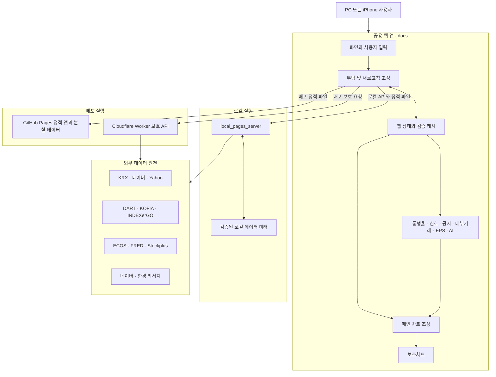
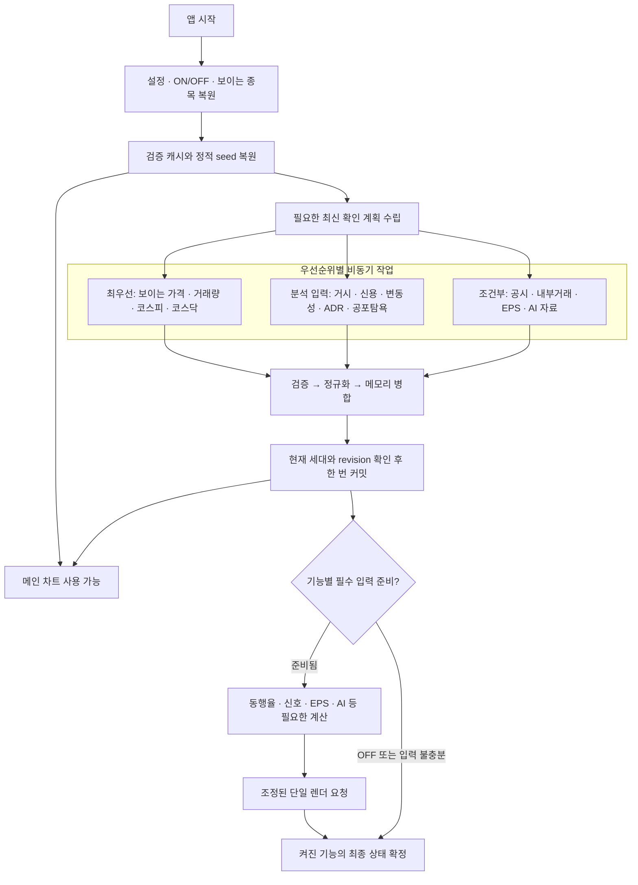
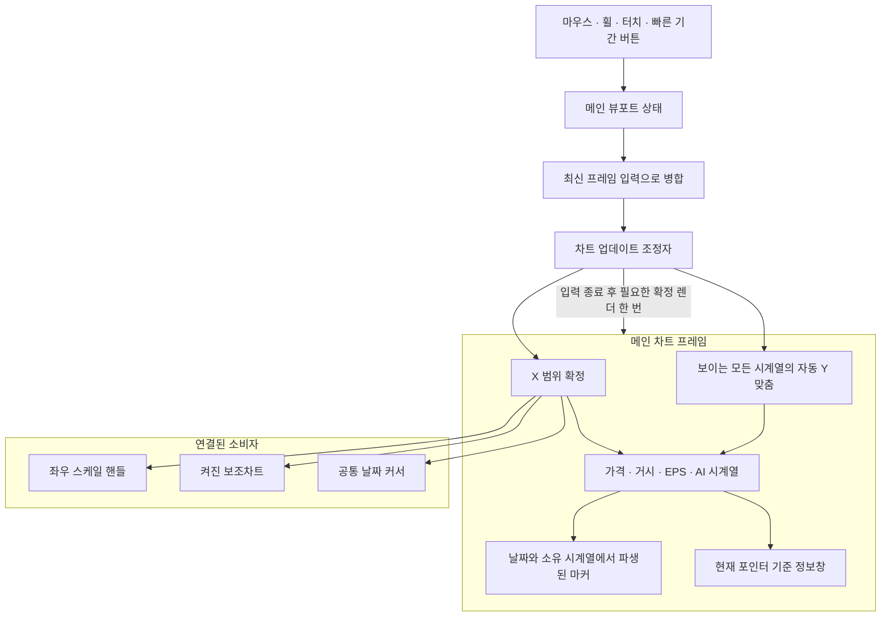

# ThinkStock Architecture

이 문서는 현재 저장소 코드에서 확인되는 실행 구조를 Mermaid로 표현한다. `THINKSTOCK_BOOT_PIPELINE_SPEC.md`의 제안 사항은 실제 코드에서 확인된 범위만 반영하며, 목표 구조를 현재 구조로 단정하지 않는다.

## 1. 실행 환경과 데이터 경계

핵심 규칙은 로컬과 배포가 서로 다른 제품을 갖는 것이 아니라, 동일한 `docs/` 앱이 데이터 접근 경계만 달리 사용한다는 것이다. 비밀키가 필요한 요청은 로컬 서버 또는 Worker 밖으로 노출하지 않는다.

## 2. 부팅과 최신 데이터 결합

캐시가 있으면 먼저 화면을 복원하고, 네트워크 응답은 검증과 병합을 거친 뒤 변경된 자료만 반영한다. 기능별 계산은 하나의 거대한 대기열이 아니라 각 기능이 실제로 요구하는 입력이 준비된 시점에 시작한다.

## 3. 차트·뷰포트·마커 관계

메인 뷰포트가 보이는 시간 범위를 소유한다. 보조차트와 커서는 같은 범위를 소비하고, 공시·내부거래·신호 마커는 별도 화면 좌표를 기억하지 않고 소유 시계열의 날짜와 값에서 위치를 얻는 것이 기준이다.

## 근거 파일

- `AGENTS.md`
- `package.json`
- `THINKSTOCK_BOOT_PIPELINE_SPEC.md`
- `docs/modules/app-bootstrap-orchestrator.mjs`
- `docs/modules/runtime-refresh-orchestrator.mjs`
- `docs/modules/runtime-data-app.mjs`
- `docs/modules/chart-update-coordinator.mjs`
- `docs/modules/chart-viewport-controller.mjs`
- `docs/modules/chart-marker-runtime.mjs`
- `docs/modules/auxiliary-chart-runtime.mjs`
- `docs/modules/market-timing-service.mjs`
- `scripts/local_pages_server.mjs`
- `worker/src/index.mjs`
